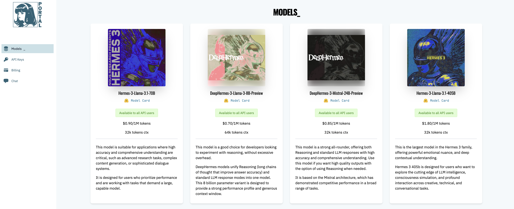

# Nous Research Automation Software



## О проекте Nous Research

[Nous Research](https://cryptorank.io/price/nous-research) — это современная AI-компания, занимающаяся разработкой продвинутых языковых моделей и технологий искусственного интеллекта.  

## Об этом софте

Этот проект предоставляет автоматизированный софт для работы с Nous Research API, позволяя:

- Работать с множеством аккаунтов одновременно
- Использовать прокси для обхода ограничений
- Задавать диапазон количества запросов на аккаунт
- Удобно управлять задержками и режимами работы (синхронный/асинхронный)
- Получать аккуратный и компактный вывод результата для удобства в терминале

В работе

- Поддерживать интеграции с Perplexity и GPT

## Фандрейз и поддержка
По данным Cryptorank, проект собрал 2 раунда:

> Series A 25 Apr 2025 -- $ 50.00M with 1 billion valuation (Paradigm)

> Seed 25 Apr 2025 -- $ 20.00M (Delphi, Distibuted Global)


## Затраты на аккаунт
На 1 аккаунт затраты составят 10$

Заходим на сайт [Nous Research](https://portal.nousresearch.com/) регистрируем аккаунт и пополняем баланс (минималка 10$)

## Установка и запуск

1. Клонируйте репозиторий:

```
git clone https://github.com/UniqueSunrise/nousResearch-auto.git
```
```
cd nousResearch-auto
```


2. Установите зависимости:
```
pip install -r requirements.txt
```

3. Создайте свои конфигурационные файлы:

- В `config.py` настройте софт;
- Добавьте файлы `api_keys.txt` [api-ключ можно взять на сайте во вкладке API Keys](https://portal.nousresearch.com/) и `proxies.txt` со своими данными.
- В файл `default_prompts_to_nous.txt` закиньте дофига разных промптов

4. Запустите софт:
```
python main.py
```

## Контакты

Если возникнут вопросы или предложения, пишите к нам в чат: [@networkDAO_chat](https://t.me/networkDAO_chat)

---

**Всего хорошего, ваш unique! 🚀**

